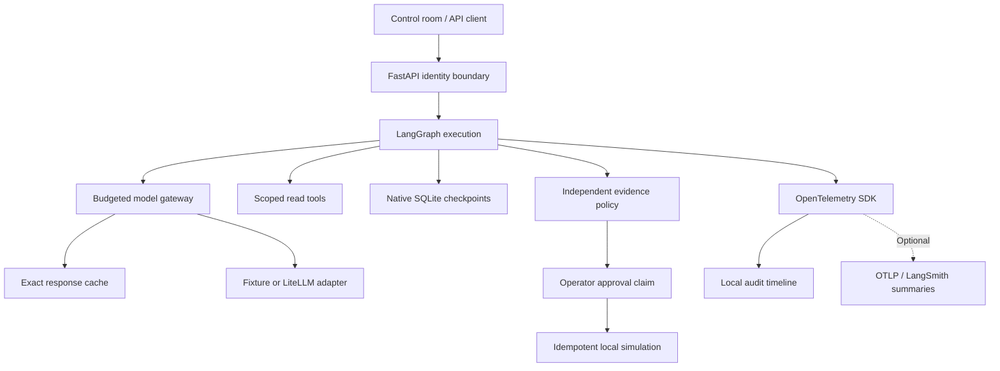
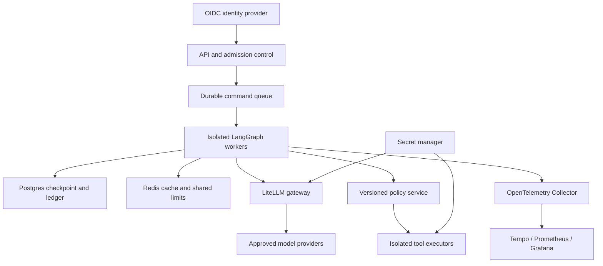

# Architecture

Aegis separates planning, model access, tool authority, durable state, and observation. The application uses six role-specific agents; roles are logical policies and prompts, not separate operating-system security sandboxes.

## Implemented topology

**Control plane.** FastAPI resolves opaque bearer credentials to a server-owned tenant, subject and role. A request cannot supply a tenant. Read APIs scope the run lookup before reading any checkpoint. The API admits eight active start/resume calls; a gateway semaphore bounds provider concurrency to four in one process.

**Execution plane.** The coordinator must choose all three distinct specialists. Native `Send` tasks run them in parallel. Each specialist has at most three decision iterations, one read tool, and its own observation list. Findings merge through a reducer; errors also merge, so one failed branch prevents synthesis from authorizing an action. Synthesis and critic run serially, with at most one revision. The graph recursion limit is 24.

**State and memory.** Native LangGraph checkpoints retain goal, plan, findings, proposal, critique and outcome. `ledger.sqlite` separately stores run ownership, budgets, approvals, cache entries and telemetry events. `checkpoints.sqlite` stores execution checkpoints. These are short-term task memory and persisted review history. There is no vector database or cross-run semantic memory masquerading as evidence.

**Permission boundary.** An accepted critique is advisory. Deterministic code checks the complete specialist set, exact tool provenance/content, evidence age, citations, latency threshold and rollback availability. Only a permitted proposal reaches the human interrupt. Approval is bound to the SHA-256 digest of the full proposal, tenant, operator role, expiry and run status.

**Execution.** The only write-like action is a local SQLite simulation result. A unique run key and an immediate transaction make that action idempotent. It cannot deploy a real service, run a shell command or send a network request.

## Gateway semantics

| Concern | Rule |
| --- | --- |
| Routing | Specialists → economy; coordinator/synthesis/critic → reasoning; fallback is a separate alias |
| Retry ownership | Harness tries each selected route at most once; configure proxy retries off |
| Failover | Only 429, 5xx, network failures or timeout; auth, request and schema errors stop |
| Circuit breaker | Two transient failures open a route for ten seconds; process-local state |
| Timeout | HTTP timeout 15s, completion deadline 16s, graph invocation deadline 60s |
| Budget | Atomic reservation before each outbound attempt; failed attempts consume budget |
| Unit accounting | Economy costs 1 policy unit; reasoning/fallback cost 2; units are not money |
| Token accounting | Provider-reported input, output and cached-token fields; fixture usage is zero |
| Cache | Exact, five-minute TTL, maximum 1,000 entries; tenant and version scoped |
| Singleflight | Fixed lock stripes avoid duplicate same-process misses; not a distributed lock |

Cache lookup precedes provider reservation, allowing cached work when outbound budget is exhausted. Local graph iterations remain bounded. A cached response is never an approval, and current authorization/evidence policy always executes after reuse. Provider-side prefix caching is a separate optional request hint; minimum prefix length, support and billing depend on the chosen provider.

## Failure and restart semantics

- Missing, stale, forged or out-of-scope evidence stops the run. Other specialist branches may finish, but no action is released.
- A checkpoint waiting for approval can resume after a process restart, without repeating model calls.
- An approval claim is atomic and single use. A crash between the claim and graph resume can leave `resuming`; Aegis deliberately does not automatically reapprove it. An operator must reconcile the checkpoint and action ledger. A durable command queue/outbox is a production extension.
- Mid-run crashes can leave `running`. Native checkpoints retain progress, but this demo does not run a recovery worker. Automatic task recovery requires leasing and replay policies.
- Unknown internal failures produce a failed ledger status and propagate as server errors; provider response bodies are never written to that ledger.

## Production target — design only

The following services are a scaling plan, not services shipped or exercised by the local demo.

Use OIDC at ingress, short-lived workload credentials, tenant-scoped LiteLLM virtual keys, database-backed monetary budgets, tenant-aware rate limits and an egress allowlist. Move native checkpointing to `AsyncPostgresSaver`; use transactional outbox delivery and idempotency receipts for real actions. Redis needs deliberate authorization-sensitive cache namespaces and distributed coordination. OPA can centralize versioned policy when multiple services share the boundary; the current policy functions are easier to audit in this small application.

Add durable approval receipts, worker leases, audit retention/erasure, encrypted databases/backups, a secrets manager, alerting, and incident recovery drills before handling real operations. Choose sandboxed tool workers such as locked-down containers or an appropriate managed sandbox only when code execution is actually required. An MCP connector must still sit behind the same capability and approval checks.

## Why this stack

LangGraph exposes branching, reducers and native resumable interrupts directly. LiteLLM provides a portable model boundary without embedding provider credentials in agent code. Pydantic makes outputs reviewable contracts. OpenTelemetry keeps traces portable; a narrow LangSmith summary bridge supports a LangSmith workflow without exporting agent state. SQLite makes the complete demonstration reproducible on a laptop.

There is no second orchestration framework, semantic cache, autonomous shell, vector store, Kubernetes manifest or Terraform stack added merely to enlarge the tool list. Each would need a concrete workload, a trust model and operational tests.

## Primary references

- [LangGraph graph API and Send](https://docs.langchain.com/oss/python/langgraph/graph-api)
- [LangGraph persistence](https://docs.langchain.com/oss/python/langgraph/persistence)
- [LangGraph durable interrupts](https://docs.langchain.com/oss/python/langgraph/interrupts)
- [LiteLLM prompt caching](https://docs.litellm.ai/docs/completion/prompt_caching)
- [LiteLLM gateway setup](https://docs.litellm.ai/docs/proxy/docker_quick_start)
- [OpenTelemetry Python instrumentation](https://opentelemetry.io/docs/languages/python/instrumentation/)
- [OWASP agentic threats and mitigations](https://genai.owasp.org/resource/agentic-ai-threats-and-mitigations/)
