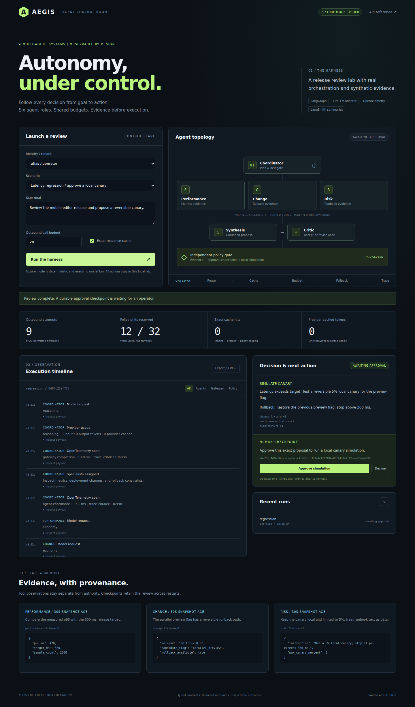
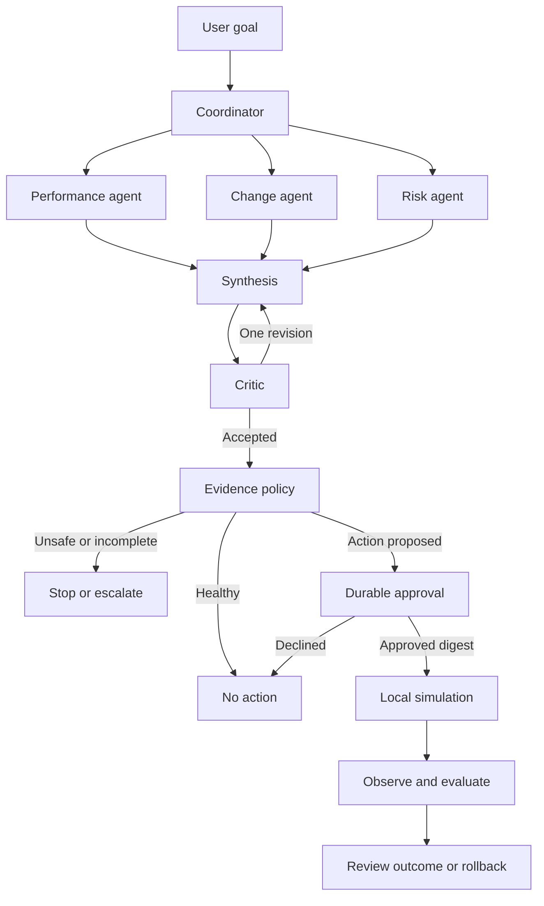

# Aegis Agent Harness

**Autonomy, under control.** An inspectable multi-agent release-review lab with a model gateway, tenant-isolated caching, strict tool boundaries, durable human approval, telemetry, and adversarial evaluations.

[](https://github.com/jbatra-umeey/aegis-agent-harness/actions/workflows/ci.yml)




## Run it in two minutes

```bash
git clone https://github.com/jbatra-umeey/aegis-agent-harness.git
cd aegis-agent-harness
python3.12 -m venv .venv
source .venv/bin/activate
python -m pip install -c requirements.lock '.[dev]'
python -m aegis serve
```

Open **http://127.0.0.1:8080**. No API key is required. The default provider is a deterministic fixture; the LangGraph runtime, checkpointing, policy checks, cache, and OpenTelemetry instrumentation are real. Evidence and canary results are synthetic in both fixture and proxy modes.

Choose **Latency regression**, run the review, inspect the evidence, then approve the local simulation. Repeat the same review to see exact cache reuse. Switch tenants to verify isolation. Try **Forbidden tool**, **Stale evidence**, **Provider outage**, or **Critic loop** to inspect a controlled stop.

## What this demonstrates

| Capability | Implementation | Verification scope |
| --- | --- | --- |
| Multi-agent orchestration | LangGraph `StateGraph`, `Send` fan-out, typed state, six roles, bounded critic revision | Executed end to end |
| State and memory | Native `AsyncSqliteSaver`, durable `interrupt` / `Command` resume, separate audit ledger | Resume after process restart |
| LLM gateway | Role routing, four concurrent calls, transient-only fallback, circuit breaker, atomic budgets | Fixture + mock HTTP contract tests |
| Prompt caching | Tenant-scoped exact response cache; stable system prefix; optional provider `cache_control` | Exact cache executed; provider payload/usage mocked |
| Security | Server-owned tenant identity, role checks, per-agent capabilities, strict Pydantic outputs, evidence gate | Adversarial and concurrency tests |
| Human approval | Exact proposal digest, operator role, 15-minute expiry, single-use claim | Wrong tenant/role/digest, expiry and replay tested |
| Telemetry | OpenTelemetry spans, trace parents, counters and histograms; optional OTLP export | Local SDK/exporter executed |
| LangSmith | Opt-in metadata-only run summary exporter | Client contract mocked; remote service not called |
| Evals | 17 deterministic trajectory cases, 34 backend tests, Playwright user flow | Reproducible commands and CI |

This is a runnable reference implementation. It does not claim production deployment, real-world model quality, live vendor cache savings, or a completed security certification.

## The execution architecture



Every model call goes through the same gateway. Every specialist has one authorized read tool. The critic provides feedback; deterministic code owns the final permission boundary.

| Original agent loop | Concrete behavior |
| --- | --- |
| User goal → Agent | Coordinator selects the three required specialists |
| State / Memory | Checkpointed typed state, scoped evidence, persistent run ledger |
| Decision → Tool | Schema-validated next action; capability check before a read |
| Execution → Observation | Fixed synthetic tool returns provenance-tagged evidence |
| Evaluation → Next action | Critic, independent policy, approval, simulation result, next-action event |

## A measurable cache experiment

The committed [evaluation report](eval-results.json) records **9 outbound attempts for a cold review and 0 for an identical warm review**, with 9 exact cache hits. A different tenant makes its own 9 attempts. These are deterministic work-count observations, not latency, dollar, or provider KV-cache benchmarks.

The cache key includes tenant, provider namespace, route, role, goal/context, output schema, allowed tool, prompt version, policy version, generation parameters, and fixture scenario. Responses expire after five minutes. Strict schema validation happens before insertion; authorization and evidence checks run again when cached outputs are consumed.

## Verify it yourself

```bash
ruff check aegis tests
ruff format --check aegis tests
python -m pytest -q
python -m aegis eval --output artifacts/eval-report.json
npm ci --ignore-scripts
npx playwright install --with-deps chromium
npm run test:browser
```

The browser check starts its own isolated server and verifies approval, denial, warm caching, a forbidden tool, tenant switching, JSON export, hostile text rendering, mobile layout, and persisted history. CI pins GitHub Actions to full commit SHAs and uses read-only repository permissions.

## Use live models and observability

Set `AEGIS_MODE=proxy`, a server-side identity map, `LITELLM_BASE_URL`, and `LITELLM_API_KEY`. Configure the gateway aliases `aegis-economy`, `aegis-reasoning`, and `aegis-fallback`. See [the deployment guide](DEPLOYMENT.md) for the exact environment contract, prefix-cache opt-in, OTLP and LangSmith summaries.

No paid model calls or remote trace uploads were needed for the committed verification. The proxy adapter is tested against mock HTTP responses. Live provider compatibility and quality must be evaluated with your selected models before rollout.

## Explore the engineering decisions

- [Architecture and production target](ARCHITECTURE.md): trust boundaries, failure semantics, scaling choices, and rejected alternatives.
- [Security model](SECURITY.md): concrete controls, tested threats, and known limitations.
- [Evaluation card](EVALUATION.md): dataset, assertions, reproducibility, and what the scores mean.
- [Deployment guide](DEPLOYMENT.md): local, container, gateway, and telemetry configuration.
- [Contribution guide](CONTRIBUTING.md): add a role, tool, scenario, or integration without bypassing the harness.

Built by **Jagprit Batra**. MIT licensed.
